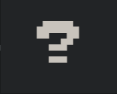
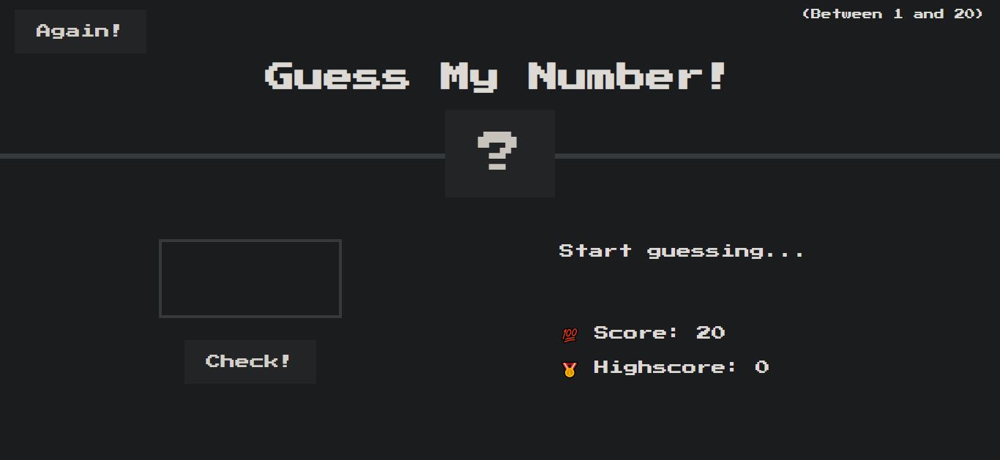
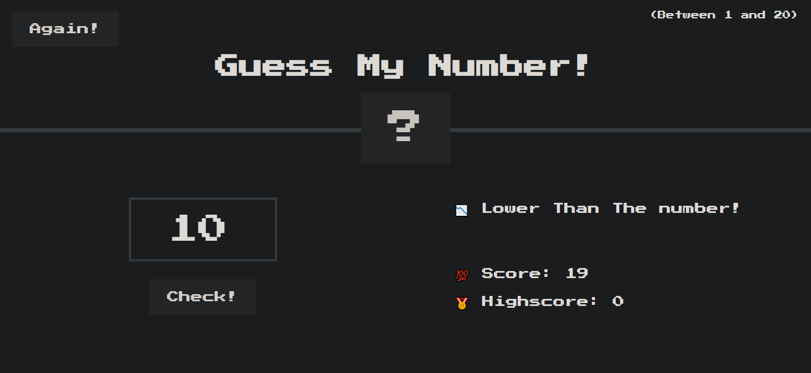
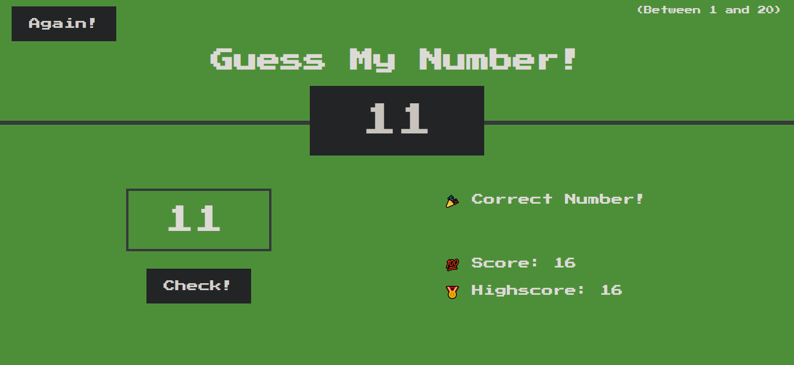

<div id="top"></div>


<!-- PROJECT LOGO  -->
<br />
<div align="center">
<a href="https://guessmynumber-e610f.web.app/">
    
</a>

<h1>Guess The Number</h1>

  <p align="center">
    <a href="https://guessmynumber-e610f.web.app/">View Demo</a>
    ·
    <a href="https://github.com/SalahShallapy/Guess-The-Number-Game/issues">Report Bug</a>
  </p>
</div>

This is a simple game where the user has to guess a secret number between 1 and 20. The game provides feedback on whether the guessed number is too high or too low. The user can keep guessing until they find the correct number, with the game keeping track of their score and high score.

## Project Overview

### Overview



### Wrong Guess Overview



### Right Guess Overview



## Features

- Random number generation between 1 and 20.
- User can input their guess and receive feedback on whether the guess is too high, too low, or correct.
- Dynamic score tracking, with the score decreasing for each wrong guess.
- Displays the high score achieved in the session.
- Option to play again with a new secret number.

## How It Works

1. **Secret Number Generation:** The game randomly generates a secret number between 1 and 20 at the start.
2. **Guessing:** The user inputs a guess and clicks the "Check!" button.
   - If the guess is correct, the game displays a success message and changes the background color.
   - If the guess is incorrect, the user is told whether their guess is too high or too low.
   - The score decreases by 1 point with each incorrect guess.
   - If the score reaches 0, the user loses the game.
3. **Highscore Tracking:** The game tracks the highest score achieved during the session and updates it whenever the user beats their previous high score.
4. **Play Again:** The user can restart the game by clicking the "Again!" button, which generates a new secret number and resets the score.

## Project Structure

```
Guess-The-Number-Game
│      .gitignore
│      .prettierrc
│      app.js
│      index.html
│      style.css
│      README.md
│
└─── Images -----> all images
```

## Installation

To get started with the project locally:

1. Clone the repository:
   ```bash
   git clone https://github.com/SalahShallapy/Guess-The-Number-Game
   ```
2. Open the Project
   Navigate to the project folder and open the index.html file in your preferred web browser to start playing.

3. Requirements
   No additional dependencies are required. The game runs entirely in the browser using vanilla JavaScript, HTML, and CSS.

## Contributing

Contributions are what make the open source community such an amazing place to learn, inspire, and create. Any contributions you make are **greatly appreciated**.

If you have a suggestion that would make this better, please fork the repo and create a pull request. You can also simply open an issue with the tag "enhancement".
Don't forget to give the project a star! Thanks!

1. Fork the Project
2. Create your Feature Branch (`git checkout -b feature/AmazingFeature`)
3. Commit your Changes (`git commit -m 'Add some AmazingFeature'`)
4. Push to the Branch (`git push origin feature/AmazingFeature`)
5. Open a Pull Request

<p align="right">(<a href="#top">back to top</a>)</p>
